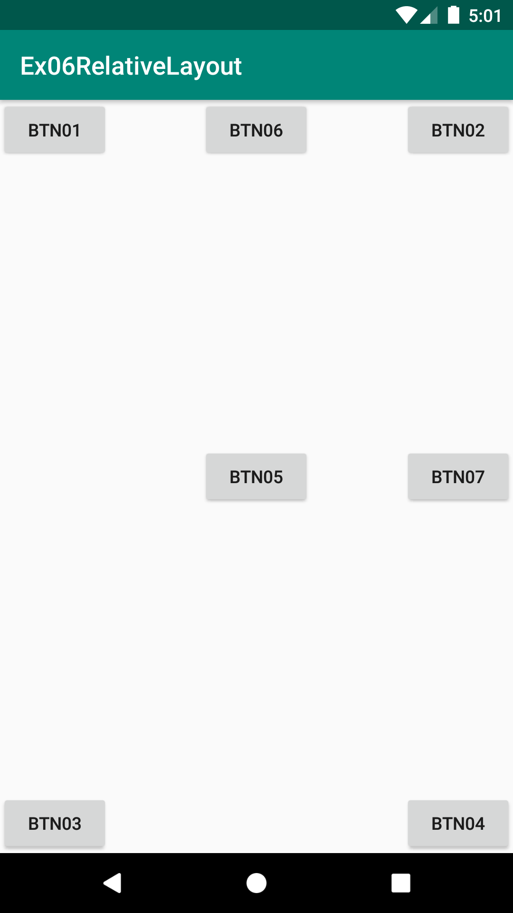
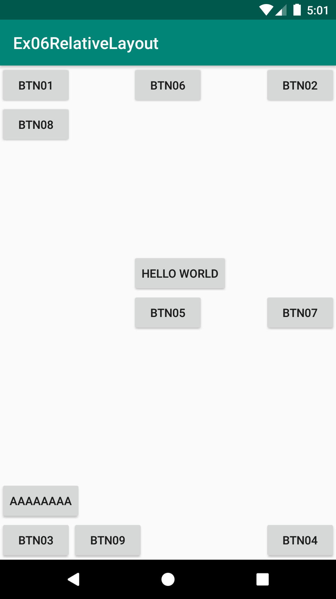
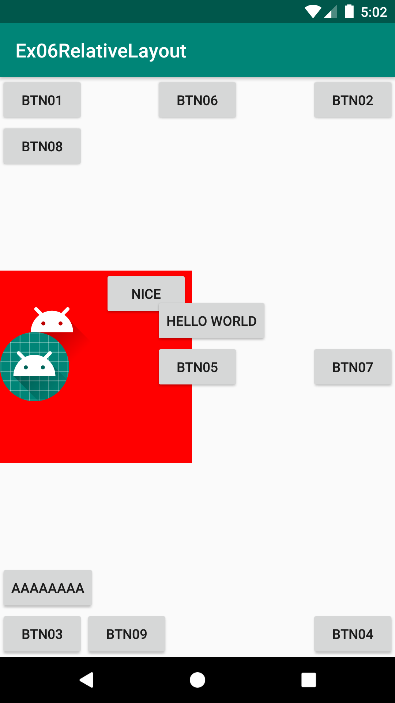

# Ex06RelativeLayout
안드로이드 네이티브 앱 개발 수업 예제#6

# 주요코드
RelativeLayout 알아보기
 + LinearLayout은 자식뷰들이 서로 겹쳐있을 수 없으나 RelativeLayout안에서는 자식뷰들이 겹쳐서 배치될 수 있음

- res폴더>>layout폴더안에 있는 activity_main.xml문서를 수정하여 화면제작
- RelativeLayout의 자식뷰들 배치에 대해 실습
  1) 부모뷰(RelativeLayout)를 기준으로 한 배치 : layout_alingParentXXX
  2) 특정뷰를 기준으로 한 상대적인(Relative) 배치
  3) 겹쳐서 배치할 때 주의할 점 
    + 기본적으로는 나중에 배치된 것이 위에 놓여져서 먼저 배치된 뷰가 가려져야 하지만 click이 가능한 뷰가 우선시 되어 위에 배치될 수 있음
    + Button은 마크업순서와 상관없이 기본적으로 다른 뷰들 보다 먼저 배치됨. (당연히 같은 Button끼리는 나중에 작성한 Button이 위에 배치됨)

# 실행모습

  
  
  

